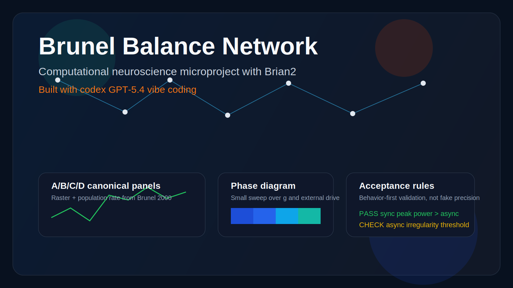

# Brunel Balance Network

<p align="center">
  
</p>

<p align="center">
  <a href="https://github.com/JustinZHAO-05/brunel-balance-network/blob/main/LICENSE"></a>
  
  
  
  
</p>

一个面向展示的计算神经科学微项目：用 `Brian2` 复现 Brunel 2000 稀疏兴奋/抑制脉冲网络中的经典群体活动状态，并把整个项目的实现过程显式记录为一次 `codex GPT-5.4 vibe coding` 实验。

## What This Repo Shows

- 复现 Brian2 官方 `Brunel_2000` 示例中的 A/B/C/D canonical panels
- 生成单次运行图、四联图、扫参相图和指标对比图
- 通过自动验收规则检验“相对行为是否正确”
- 保留 vibe coding 协议、关键决策和修复记录，便于公开展示与复查

## Core Outputs

- `Figure 1`：四个 canonical panels 的 raster + population rate
- `Figure 2`：`g x nu_ext/nu_thr` 小型相图热图
- `Figure 3`：关键指标 + 自动验收结果
- `artifacts/acceptance.json`：规则级判定结果

## Project Story

这个仓库不是为了追求论文级数值完全一致，而是为了回答一个更实际的问题：

`Codex 能不能在一个真实但可控的计算神经科学任务里，端到端产出能运行、能解释、能展示、能复现的项目？`

当前答案是：可以完成建模、配置、仿真、分析、绘图、测试、仓库管理和开源发布；同时也会真实暴露模型缩放和验收阈值上的不足，而不是用手工修饰把结果伪装成“全部通过”。

## Stack

- `Python 3.10`
- `Brian2 2.7.1`
- `NumPy / SciPy / Matplotlib / Pandas / PyYAML / pytest`

## Quick Start

```bash
python3 -m venv .venv || python3 -m virtualenv .venv
. .venv/bin/activate
pip install -r requirements.txt
python -m src.reproduce --preset quick
```

运行完成后可查看：

- `artifacts/reproductions/quick/figure1_panels.png`
- `artifacts/reproductions/quick/figure2_phase_diagram.png`
- `artifacts/reproductions/quick/figure3_metrics.png`
- `artifacts/acceptance.json`

## CLI

这 5 条命令对应 4 类工作流：单次仿真、单次分析、批量扫参和整套复现。

```bash
python -m src.simulate --config configs/presets/panel_c.yaml
python -m src.analyze --run-dir artifacts/runs/panel_c
python -m src.sweep --config configs/sweeps/quick.yaml
python -m src.reproduce --preset quick
python -m src.reproduce --preset poster
```

### `simulate`

```bash
python -m src.simulate --config configs/presets/panel_c.yaml
```

作用：运行一次 Brunel 平衡网络仿真，只生成原始结果，不做指标分析和汇总图。

输入：
- 一个单次实验配置文件，例如 `configs/presets/panel_c.yaml`

输出：
- 默认目录 `artifacts/runs/panel_c/`
- 主要文件：`spikes.npz`、`population_rate.csv`、`config_resolved.yaml`、`run_manifest.json`

适合场景：
- 先确认某个 panel 能否跑通
- 想拿原始 spike / rate 数据做自己的后处理

### `analyze`

```bash
python -m src.analyze --run-dir artifacts/runs/panel_c
```

作用：读取一个已经完成的运行目录，计算指标并生成图表。

输入：
- 一个由 `simulate` 生成的运行目录，例如 `artifacts/runs/panel_c`

输出：
- 在同一目录下补充 `metrics.json`、`raster.png`、`rate_trace.png`、`summary.png`

适合场景：
- 已经有仿真结果，只想重新计算指标或重新出图
- 将“仿真”和“分析”两步分开执行

推荐成对使用：

```bash
python -m src.simulate --config configs/presets/panel_c.yaml
python -m src.analyze --run-dir artifacts/runs/panel_c
```

### `sweep`

```bash
python -m src.sweep --config configs/sweeps/quick.yaml
```

作用：对一个参数网格批量执行“仿真 + 分析”，用于生成小型相图。

输入：
- 一个扫参配置文件，例如 `configs/sweeps/quick.yaml`

输出：
- 默认目录 `artifacts/sweeps/quick/`
- `runs/`：每个参数组合的单独运行结果
- `summary.csv`：所有组合的指标汇总
- `phase_diagram.png`：扫参热图

适合场景：
- 想看 `g` 和 `nu_ext_over_nu_thr` 如何改变网络动力学
- 不只关心单个 panel，而是关心状态空间

### `reproduce --preset quick`

```bash
python -m src.reproduce --preset quick
```

作用：一键执行项目的快速复现流程。它会自动：

- 跑 A/B/C/D 四个 canonical panels
- 分析每个 panel
- 生成 Figure 1 四联图
- 跑 quick sweep
- 生成 Figure 2 相图
- 生成 Figure 3 指标与验收图
- 写入 `artifacts/acceptance.json`

输出：
- `artifacts/reproductions/quick/`
- `artifacts/acceptance.json`

适合场景：
- 第一次完整体验这个项目
- 开发阶段快速自测
- CI 或日常回归验证

### `reproduce --preset poster`

```bash
python -m src.reproduce --preset poster
```

作用：执行展示版复现流程，和 `quick` 相同，但网络规模和扫参密度更大。

当前默认差异：
- `quick`：`N_E=1500`，记录 80 个神经元，扫参较小
- `poster`：`N_E=4000`，记录 120 个神经元，扫参更密

适合场景：
- 生成更适合公开展示的最终图
- 准备仓库截图、汇报材料或 poster 素材

代价：
- 比 `quick` 更慢
- 更适合最终展示，不适合作为高频调试入口

### Recommended Order

如果你是第一次运行，按下面顺序最合理：

```bash
python -m src.simulate --config configs/presets/panel_c.yaml
python -m src.analyze --run-dir artifacts/runs/panel_c
python -m src.reproduce --preset quick
python -m src.reproduce --preset poster
```

一句话概括：

- `simulate`：只生产原始仿真数据
- `analyze`：对已有运行结果算指标、出图
- `sweep`：批量扫参数并画相图
- `reproduce quick/poster`：把整个项目从头到尾跑一遍

## Repository Layout

- `src/`：仿真、分析、绘图和 CLI
- `configs/`：单次预设和扫参配置
- `artifacts/`：运行结果、图和自动验收文件
- `docs/`：报告、参考资料和 vibe coding 记录
- `tests/`：单元测试与集成测试

## Vibe Coding Record

- 协议：[`docs/vibe_protocol.md`](docs/vibe_protocol.md)
- 日志：[`docs/vibe_log.md`](docs/vibe_log.md)
- 报告：[`docs/report.md`](docs/report.md)

项目主页和仓库文案都明确保留了这个事实：本项目使用 `codex GPT-5.4 vibe coding` 完成。

## References

- Brian2 example: https://brian2.readthedocs.io/en/latest/examples/frompapers.Brunel_2000.html
- Brunel, 2000: https://doi.org/10.1023/A:1008925309027
